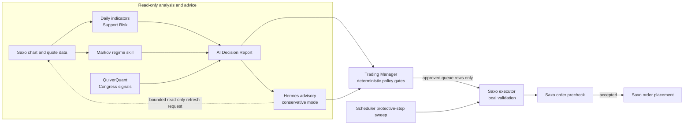

# saxo-daytrader-xai

Rust/Dioxus conversion of the Saxo day-trading dashboard. The active runtime is now a single Rust binary, `saxo-rust`, built with Axum for HTTP/API routes and Dioxus SSR for the dashboard UI.

The Python/FastAPI and Next.js implementation this project began as has been removed; `saxo-rust` owns the dashboard, scheduler, Saxo session handling, decision reports, Trading Manager queue creation, order placement, broker status sync, fill reconciliation, and protective stops. `scripts/` retains four Python utilities that are still wired to something: two backup CronJob scripts, the Saxo OAuth helper, and an execution-regression validator. [wiki/log.md](wiki/log.md) holds the dated record of what was removed and when.

## Current Rust Runtime

- Rust 2024 project at [Cargo.toml](Cargo.toml).
- Single HTTP process serving the dashboard and `/api/*` JSON endpoints on port `8000`.
- Dioxus-rendered dashboard in [src/main.rs](src/main.rs).
- Workspace-local Cargo cache supported through `CARGO_HOME=.cargo-home`.
- Docker image built from [Dockerfile.api](Dockerfile.api).
- The Rust app runs in Kubernetes namespace `saxo`.
- The existing CloudNativePG database remains in namespace `saxo`; the Rust app connects to it through the cross-namespace service DNS name `daytrader-postgres-rw.saxo.svc.cluster.local`.
- Kubernetes now deploys `daytrader-api`, a `daytrader-frontend` service pointing at that Rust app, and `daytrader-scheduler` from the Rust image. The `daytrader-frontend` Service is a routing alias for the API pods (the shared ngrok gateway targets it); the legacy Next.js `frontend/` directory itself was removed 2026-07-04 — the Dioxus SSR dashboard is the committed UI.
- Hermes Agent self-improvement is designed as a separate, gated research/reflection workflow. See [docs/hermes-agent.md](docs/hermes-agent.md) for the goal contract, one-variable experiment model, Kubernetes shape, MCP boundary, and safety invariants.
- The Markov method runs as a daily advisory regime skill for portfolio/watchlist assets and is exposed through the dashboard, API, Hermes context, and AI decision prompt context without mutating orders. See [docs/markov-method.md](docs/markov-method.md).
- Daily indicators derive technical confluence, ATR, and support-risk context from Saxo chart history. The support view identifies a nearby historical support zone, downside to that zone, potential downside after a break, break risk, and evidence confidence. It is advisory context, not an automatic trading gate.
- QuiverQuant Congress-trading signals run for the US universe 45 minutes after the calendar-aware US open. They are available to the dashboard, Hermes, and the later US Decision Report as corroborating or risk-reducing context only. See [docs/quiver-signals.md](docs/quiver-signals.md).
- Read-only benchmark comparison stores Saxo-backed proxy price series and reports portfolio excess return in the End-of-Day view; it is deliberately excluded from strategy, sizing, and execution. See [docs/performance-benchmarks.md](docs/performance-benchmarks.md).
- The scheduler maintains broker-hosted protective stops for covered holdings under a constrained ATR policy. Stops are separate from discretionary decision-report orders, are revalidated through Saxo, and cannot protect against every gap or unavailable-market scenario.
- Project knowledge is organized through an LLM-maintained wiki under [wiki/](wiki), with workflow details in [docs/project-wiki.md](docs/project-wiki.md).

## Current Architecture And Execution Boundary

The system deliberately separates **observation and advice** from **broker mutation**. Markov, daily indicators and Support Risk, Quiver, benchmarks, the AI Decision Report, and Hermes all enrich operator and Trading Manager context. None has a direct Saxo order tool.



### What Enforces The Execution Boundary

An LLM or Hermes response is an advisory report, not a broker instruction. Before any request can reach Saxo, independent server-side controls must approve it:

1. **Response validation:** malformed or non-JSON provider output becomes an errored report, not an order. The normalized report is scope-filtered before it can be considered by the manager.
2. **Trading Manager gates:** only fresh eligible reports are considered. Deterministic checks enforce order shape, market status, cash buffer, loss/drawdown circuit breakers, exclusions and quarantine, technical and Markov evidence, ATR-based risk sizing, concentration, position limits, commissions, and minimum trade value. Model-provided prices and indicators are not treated as authoritative.
3. **Execution queue gates:** execution must be explicitly enabled for the Saxo adapter and environment. The executor consumes only approved queue rows, prevents duplicate submission, validates the Saxo session, market tradability, whole-share quantity, sellable holdings, Saxo instrument/UIC, and broker tick size.
4. **Broker enforcement:** Saxo `/trade/v2/orders/precheck` must succeed before placement. Saxo remains the final authority on account, instrument, market, price, buying power, and order rules. Ambiguous outcomes are reconciled rather than blindly retried.

Prompt-injection resistance in provider instructions is useful, but it is not the primary safety boundary. The hard boundary is the deterministic Rust manager/executor path plus Saxo validation. In conservative mode Hermes may block, reduce, or require review; it cannot add a trade, increase a quantity, approve an order, or call a Saxo mutation endpoint.

For the full current-state map and boundaries, see [wiki/concepts/current-system-architecture.md](wiki/concepts/current-system-architecture.md).

## What The System Does

Grouped by boundary rather than by history. Everything listed here is live; for
what was removed and when, read [wiki/log.md](wiki/log.md).

**Advisory, read-only.** Markov regime signals on intraday bars, daily technical
indicators with ATR and support-risk zones, QuiverQuant congressional signals for
the US universe, editorial-research headlines screened for prompt injection, and
Saxo-backed benchmark proxies. None of these can place, size, or approve an order.

**Decision.** An OpenRouter-backed report per analysis pulse produces structured
JSON with rationale, symbol sentiment, and suggested trades. Reports are
scope-filtered to the pulse's tradable exchanges, persisted with prompt and raw
response, and audited for completion quality. Mid-session shadow reports are
observation-only and can never enter the manager queue.

**Advisory review.** Hermes reviews each report in conservative mode and may
block, reduce, or require review; it cannot add a trade, increase a quantity,
approve an order, or reach a Saxo mutation endpoint. When an input is missing or
stale it can request a bounded read-only refresh instead of blocking on it.

**Deterministic policy.** The Trading Manager applies order shape, market status,
cash buffer, monthly-loss and drawdown circuit breakers, exclusions and instrument
quarantine, technical and Markov evidence, ATR risk sizing, concentration and
holding limits, commission floors, and minimum trade value. Model-supplied prices
and indicators are never treated as authoritative.

**Execution.** Approved queue rows only, behind explicit adapter and environment
enablement, with whole-share quantities, Saxo instrument and tick validation, and
a mandatory `/trade/v2/orders/precheck`. Broker-hosted protective stops are placed
and ratcheted by a scheduler sweep, separate from decision-report orders.

**Accounting.** Immutable trade ledger with lot realisation, Danish share-income
tax brackets, FX-split realised gains, commission and FX-conversion costs, and
immutable `execution_fills` / `execution_order_events` broker history.

**Operations.** Postgres via CloudNativePG in Kubernetes and SQLite locally,
scheduled backups with retention, exchange-calendar market hours, immutable
scheduler cycle history, Slack and email digests with throttling and per-kind
routing, and an LLM-maintained wiki under [wiki/](wiki).

## Install

```bash
make install
```

## Run

```bash
make run
```

Useful options:

```bash
API_PORT=8001 make run
make scheduler
```

The Rust app reads `DAYTRADER_CONFIG` when set and otherwise uses `config.yaml`. It prefers `DATABASE_URL` for Kubernetes/PostgreSQL and falls back to `portfolio.database_path` for local SQLite.

## Web UI

- Rust Axum/Dioxus app at `http://127.0.0.1:8000`
- Health check at `http://127.0.0.1:8000/api/health`
- Read-only API compatibility endpoints under `/api/*`
- SSO session JSON at `/auth/session` and `/api/auth/session`, populated from ngrok-injected `x-daytrader-user-*` headers.
- Saxo session endpoints at `/api/saxo/auth/status`, `/api/saxo/auth/start`, `/api/saxo/auth/callback`, `/api/saxo/session`, `/api/saxo/session/refresh`, `/api/saxo/session/logout`, and `/api/saxo/session/disconnect`.
- The Saxo session is persisted in the `saxo_sessions` database table so a Kubernetes rollout can restore the refresh token into a new pod. The local `/tmp/daytrader/saxo_session.json` file is only an ephemeral working copy inside each pod. Dashboard SSO logout deliberately does not clear this service-level session; use `/api/saxo/session/disconnect` only when the Saxo refresh token should be removed.
- Localization defaults live under `localization` in config and drive thousands separators, decimal separators, week start, time zone, and 12/24-hour display.
- Dashboard tabs are server-rendered at `/?view=performance`, `/?view=market`, `/?view=watchlists`, and `/?view=decisions`.
- The Rust scheduler proactively checks the Saxo session every scheduler interval and refreshes the token when it is inside the safety margin.

Rust owns the active Decision Report, Trading Manager queue, Saxo precheck, placement, broker-status sync, and reconciled-fill paths. Each mutation remains configuration-gated and auditable; broker-management behavior that does not yet have matching Rust audit/status coverage remains fail-closed rather than being enabled by the dashboard.

## Docker Desktop Kubernetes

The repository includes a local Docker Desktop Kubernetes deployment with app resources in namespace `saxo` and the CNPG database in namespace `saxo`. It runs two Rust workloads:

- `daytrader-api`: Rust Axum/Dioxus app on port `8000`.
- `daytrader-frontend`: Kubernetes Service pointing at `daytrader-api` for the ngrok public endpoint.
- `daytrader-scheduler`: singleton Rust scheduler using the same config and database-backed Saxo session state; it runs session maintenance, calendar-aware reports, advisory enrichment, manager/execution cycles, protective-stop maintenance, and EOD journal work.

The API and scheduler use the existing `saxo/daytrader-postgres` CloudNativePG cluster as the live database via `DATABASE_URL`. Saxo OAuth state is persisted in the `saxo_sessions` table in Postgres; pods use `/tmp/daytrader/saxo_session.json` only as an ephemeral helper file while reading or refreshing the token. The table contains Saxo tokens, so database access should be treated as credential access.

The deployment also creates:

- `daytrader-postgres`: a two-instance CloudNativePG cluster with one primary and one standby in namespace `saxo`.
- S3-compatible CloudNativePG backup target: RustFS running in the Docker context so it can persist objects to the local filesystem.
- `saxo/daytrader-postgres-app`: CNPG app-user secret; deploy also mirrors a `DATABASE_URL`-only `daytrader-postgres-app` secret into `saxo` because Kubernetes secret references cannot cross namespaces.

The `saxo/daytrader-frontend` service is exposed through the shared ngrok gateway maintained in `../shared-ngrok-gateway`. This repo owns only the internal `saxo-daytrader.internal` AgentEndpoint that points to the daytrader service; the shared repo owns the public endpoint, Google OAuth allow-list, and `/saxo-daytrader` path routing. The Kubernetes config sets `app.public_base_path: /saxo-daytrader` so rendered links, forms, and assets stay under that prefix even when ngrok strips the prefix before forwarding. The deploy script derives `DAYTRADER_PUBLIC_BASE_URL=https://$NGROK_DOMAIN/saxo-daytrader` when `DAYTRADER_PUBLIC_BASE_URL` is not set; Saxo OAuth uses that configured URL for the callback instead of trusting internal forwarded hosts.

Required `.env` values:

```bash
NGROK_DOMAIN=your-domain.ngrok.app
BACKUP_OBJECT_STORE=rustfs
BACKUP_BUCKET=daytrader-cnpg
RUSTFS_ENDPOINT_URL=http://host.docker.internal:9000
RUSTFS_ACCESS_KEY=rustfsadmin
RUSTFS_SECRET_KEY=rustfsadmin
POSTGRES_APP_USER=daytrader
POSTGRES_APP_PASSWORD=change-me
HERMES_API_SERVER_ENABLED=false
HERMES_API_SERVER_HOST=0.0.0.0
HERMES_API_SERVER_KEY=
HERMES_API_SERVER_CORS_ORIGINS=http://127.0.0.1:8000
OPENROUTER_API_KEY=...
HERMES_INFERENCE_PROVIDER=openrouter
HERMES_MODEL=openai/gpt-5.5
HERMES_DASHBOARD=false
HERMES_DASHBOARD_TUI=false
HERMES_DAYTRADER_API_KEY=
HERMES_DAYTRADER_API_BASE_URL=http://daytrader-api.saxo:8000
HERMES_DAYTRADER_MCP_URL=http://daytrader-mcp.saxo:8610/mcp
HERMES_GATEWAY_URL=http://hermes-gateway.saxo:8642
HERMES_TRADING_MANAGER_ADVISORY_ENABLED=true
HERMES_TRADING_MANAGER_ADVISORY_MODE=conservative
HERMES_TRADING_MANAGER_ADVISORY_WAIT_SECONDS=90
```

`NGROK_DOMAIN` is used only to derive `DAYTRADER_PUBLIC_BASE_URL`; set `DAYTRADER_PUBLIC_BASE_URL` directly if the app should use a different public callback base. The ngrok API key, authtoken, OAuth provider, and allow-list now belong in `../shared-ngrok-gateway`. `BACKUP_OBJECT_STORE` should be `rustfs`; RustFS runs in the Docker context and exposes the S3-compatible endpoint at `RUSTFS_ENDPOINT_URL`, defaulting to `http://host.docker.internal:9000` for Kubernetes pods. Keep the existing Saxo, OpenRouter, Slack, and OpenFIGI values in `.env`; the deploy script creates the Kubernetes secret from that file.

Deploy to Docker Desktop:

```bash
make k8s-deploy
```

Useful Kubernetes targets:

```bash
make docker-build
make deps-dry-run
make security-scan
make k8s-status
make k8s-db-status
make post-deploy-smoke
make post-deploy-guard
make shared-ngrok-status
make k8s-stop
```

`make deps-dry-run` shows available Cargo.lock updates without changing files.
`make security-scan` runs RustSec advisory checks, Trivy high/critical fixed-CVE
scans for the repository and local images, and a secret scan. Run it before
releases, after base-image changes, and after adding dependencies. See
[wiki/runbooks/build-test-deploy.md](wiki/runbooks/build-test-deploy.md)
for the remediation workflow.

`make k8s-deploy` builds local Rust and backup images tagged with the full committed Git SHA by default, prepares the configured S3-compatible backup target, creates the `daytrader-cnpg` bucket, installs or upgrades CloudNativePG via Helm, applies/keeps the database resources in `saxo`, applies the Rust app resources in `saxo`, and applies the app-owned internal `saxo-daytrader` AgentEndpoint. `IMAGE_TAG`, `API_IMAGE`, and `BACKUP_IMAGE` remain explicit operator overrides. It does not apply the shared public ngrok gateway; run `ENV_FILE=../rust_daytrader/.env make apply` from `../shared-ngrok-gateway` when shared edge routing or OAuth config changes. With `BACKUP_OBJECT_STORE=rustfs`, it leaves the external RustFS container running and only verifies/creates the bucket. At runtime the app writes the latest Saxo session to the `saxo_sessions` table, so future rollouts can recover without another OAuth login while the refresh token remains valid.

The Kubernetes manifests use `imagePullPolicy: IfNotPresent`. This is intentional for Docker Desktop: the deploy script builds local images into the Docker Desktop image store and then updates deployments to those concrete image tags.

The S3-compatible backup target intentionally runs outside Kubernetes because Docker Desktop Kubernetes `hostPath` volumes are node-local and did not reliably mirror object files into the macOS project folder. RustFS runs separately in the Docker context on the host port in `RUSTFS_ENDPOINT_URL`, using a normal Docker bind mount for local filesystem persistence.

CloudNativePG currently reports the built-in `barmanObjectStore` backup stanza as deprecated for a future CNPG release. It works for this local deployment, but the longer-term replacement is CNPG's Barman Cloud Plugin.

## Hermes Agent Research Loop

The Hermes integration plan keeps self-improvement outside the live broker mutation path. Hermes can observe scheduler cycles, the two daily market-pulse decision reports, daily end-of-day reports, Markov regime signals, execution outcomes, and strategy journals through a read-mostly adapter, then propose one-variable experiments against an explicit goal contract. Proposed prompt/config/strategy changes must be recorded, reviewed, tested in backtest or SIM/paper mode, and promoted by an operator before they can become a baseline audit record. The dashboard includes a `Hermes` tab at `/?view=hermes` for reviewing stored reflections, moving experiment proposals through paper/SIM lifecycle states, promoting successful experiments into `strategy_baselines`, and showing the active baseline audit record. The Rust Trading Manager can apply an operator-approved SIM/paper overlay for a small allowlist of strategy variables, and it can ask Hermes for per-decision-report advisory input before queueing orders. Kubernetes runs that advisory hook in `conservative` mode: Hermes may only block, reduce, or require review and can never add trades, increase size, approve live orders, or call Saxo mutation endpoints. Missing or timed-out conservative advice requires review instead of silently allowing orders. Promoted baselines are included in Hermes context and future AI decision prompts as advisory context; they do not activate live broker behavior.

The Kubernetes base now includes `Deployment/hermes-agent`, `Deployment/daytrader-mcp`, `PVC/hermes-data`, `Service/hermes-gateway`, `Service/daytrader-mcp`, `ConfigMap/hermes-daytrader-context`, and suspended `CronJob/hermes-daily-reflection` plus `CronJob/hermes-weekly-reflection`. The services are internal-only. Hermes exposes gateway port `8642` plus dashboard port `9119` if enabled; the MCP adapter exposes port `8610` and only Hermes-safe tools. The deploy script creates a separate `hermes-env` secret from a whitelist of Hermes/model/chat variables; Saxo credentials are not included in that secret. Set `HERMES_API_SERVER_ENABLED=true` and a strong `HERMES_API_SERVER_KEY` when the internal Hermes API should be reachable. Set `HERMES_INFERENCE_PROVIDER` and `HERMES_MODEL` to a model/provider the configured Hermes account can access, and set `HERMES_DAYTRADER_API_KEY` so Hermes can call the app's protected `/api/hermes/*` adapter endpoints or the `daytrader-mcp` adapter.

To enable the daily EOD and weekly Hermes reflections after deployment:

```bash
rtk kubectl --context docker-desktop -n saxo patch cronjob hermes-daily-reflection -p '{"spec":{"suspend":false}}'
rtk kubectl --context docker-desktop -n saxo patch cronjob hermes-weekly-reflection -p '{"spec":{"suspend":false}}'
```

To trigger immediate runs while keeping the schedules suspended:

```bash
rtk kubectl --context docker-desktop -n saxo create job --from=cronjob/hermes-daily-reflection hermes-daily-reflection-manual
rtk kubectl --context docker-desktop -n saxo create job --from=cronjob/hermes-weekly-reflection hermes-weekly-reflection-manual
```

See [docs/hermes-agent.md](docs/hermes-agent.md) for the full architecture and rollout plan.

## Project Knowledge Wiki

The repository has a persistent LLM-maintained knowledge layer under [wiki/](wiki). It is intended for maintained project synthesis: architecture decisions, Saxo safety lessons, Hermes reflections, strategy experiments, and operational runbooks. Use [wiki/index.md](wiki/index.md) as the entry point and [wiki/schema.md](wiki/schema.md) as the maintenance contract.

See [docs/project-wiki.md](docs/project-wiki.md) for qmd and Obsidian setup.

PostgreSQL backup strategy:

- Kubernetes runs `daytrader-postgres-backup-schedule` at `15` minutes past each hour from `09:15` through `23:15`, Monday through Friday, in `Europe/Copenhagen` local time.
- Weekend backups are intentionally skipped while markets are closed. The last scheduled backup before the weekend is Friday `23:15` Copenhagen time; the cycle resumes Monday `09:15` Copenhagen time.
- The backup CronJob creates CloudNativePG `Backup` resources for `daytrader-postgres` using the `barmanObjectStore` method.
- The old CNPG `ScheduledBackup` resource is not used because the installed CNPG CRD does not expose a Kubernetes-style timezone field; using a Kubernetes CronJob keeps the schedule aligned with Copenhagen local time and DST.
- `daytrader-postgres-backup-retention` runs at `30` minutes past each hour on the same weekday backup window, after the scheduled backup should have completed.
- The retention job also purges weekend backups once at least one weekday backup exists, so old weekend backups from a previous schedule are kept only as a temporary safety net until the Monday cycle resumes.
- Retention keeps the latest `24` hourly backups.
- Older backups are compacted into one backup per day for `7` days.
- Older backups are compacted into one backup per ISO week for `4` weeks.
- Older backups are compacted into one backup per month for `12` months.
- Older backups are compacted into one backup per year for `10` years.
- The retention job deletes pruned CNPG `Backup` resources, invalid CNPG `Backup` resources whose base backup object is missing, and matching S3-compatible base-backup prefixes under `daytrader-cnpg/daytrader-postgres/base/`.
- WAL retention is kept conservative at `3650d` in CNPG so long-term retained base backups remain recoverable. This uses more storage, but avoids deleting WAL segments that a retained backup may need.

## Config Reference

The project is driven by [config.yaml](config.yaml). Values written as `ENV:NAME` are loaded from `.env`.

### `app`

- `project_name`: display name used in the UI.
- `environment`: free-form environment label such as `local`.
- `dry_run`: when `true`, live broker submission and live broker management are blocked even if `execution.mode` is `live`.
- `simulation_mode`: legacy convenience flag; execution behavior is primarily controlled by `execution.mode`.

`launch_scheduler_with_ui`, `scheduler_restart_on_failure`, `scheduler_max_restarts`
and `scheduler_restart_delay_seconds` were the Python launcher's supervision
settings and are read by nothing in the Rust runtime. They were removed from the
shipped configuration on 2026-09-01. In Kubernetes the API and scheduler are
separate Deployments, so restart supervision belongs to Kubernetes rather than to
the application.

### `portfolio`

- `base_currency`: reporting currency. The project assumes `DKK`.
- `source_csv`: Saxo export used for the latest imported holdings baseline.
- `database_path`: SQLite database path, usually `ledger.db`.
- `database_url`: optional PostgreSQL DSN. In Kubernetes this is set to `ENV:DATABASE_URL` and takes precedence over `database_path`.
- `initial_cash_dkk`: starting cash balance used for cash-aware portfolio value and buy-side limits. Buys reduce it, sells increase it through recorded `net_amount_dkk`.
- `virtual_cap_dkk`: upper bound for the strategy's independently tracked capital book. It does not alter the broker account balance.
- `broker_cash_reconciliation_enabled`: default `false`. Set this to `true` only when the DKK strategy ledger and the selected Saxo account represent the same capital book. Broker snapshots are always retained for execution and audit; this flag controls only the absolute-cash integrity comparison.

### `market_data`

- `refresh_interval_seconds`: general UI/data refresh cadence for quote-oriented functions.
- `request_timeout_seconds`: timeout for market-data HTTP calls.
- `watchlists.nordic_limit`: target number of Nordic names shown in the watchlist.
- `watchlists.uk_limit`: target number of UK names shown in the watchlist.
- `watchlists.us_limit`: target number of US names shown in the watchlist.
- `watchlists.eu_limit`: target number of continental Europe / Euronext names shown in the watchlist.
- `watchlists.global_limit`: number of combined US/Europe names supplied to decision-report context.
- `watchlists.universe_symbols`: versioned, source-controlled candidate membership for Markov, daily indicators, and decision reports. Current broker positions and `extra_symbols` are always additive. Keep this list populated; an empty list activates a warning-level legacy archive fallback for migration only.
- `rss.market_feeds`: RSS feeds for company/market headlines.
- `rss.macro_feeds`: RSS feeds for macro and central-bank headlines.
- `rss.crypto_feeds`: RSS feeds included in macro pulse context for crypto/risk-appetite signals.

### `price_monitor`

- `enabled`: enables persisted portfolio quote polling in the background worker.
- `poll_interval_minutes`: how often the scheduler refreshes latest portfolio prices while the price monitor is active. Current default is `1`.
- `post_close_grace_minutes`: how long quote polling continues after the final tracked exchange closes before it pauses until the next exchange open. Current default is `15`.
- `reset_hour_local`: local hour used as the daily baseline reset point. Current default is `6`.
- `timezone`: timezone used for the reset boundary. Default is `Europe/Copenhagen`.
- `history_max_rows`: optional cap on stored portfolio-value history points. `0` means unlimited.
- `history_retention_days`: optional max age for stored portfolio-value history points. `0` means unlimited.

The price monitor stores latest portfolio quotes in SQLite, appends portfolio-value history points for the Performance tab, and uses the first quote after the configured reset hour as the baseline for that day. Daily P/L in the UI is then calculated relative to that baseline instead of relying only on the CSV import. Quote polling runs while at least one tracked exchange is open, and keeps running for the configured post-close grace period after the last close. After that it pauses until the next tracked exchange opens.

### `analysis_windows`

- `offset_minutes_after_open`: how long after an exchange open the system starts considering that market eligible for analysis.
- `duration_minutes`: how long the analysis window stays active after the offset.
- `calendar_refresh_interval_minutes`: how often exchange session calendars are refreshed.
- `calendar_lookback_days`: how much recent session history is cached.
- `calendar_lookahead_days`: how far future holiday/session data is cached.

Example: with `offset_minutes_after_open: 30` and `duration_minutes: 0`, a market that opens at `09:00` local will have an analysis window from `09:30` until 15 minutes before the exchange-specific tradable close.

### `scheduler`

- `enabled`: enables the scheduler worker.
- `poll_interval_minutes`: how often the worker wakes up and runs one scheduler cycle.
- `startup_run`: when `true`, a cycle runs immediately when the scheduler starts instead of waiting for the first interval boundary.
- `history_max_rows`: maximum scheduler-cycle history rows to retain.
- `history_retention_days`: maximum age of scheduler-cycle history rows.

### `strategy`

- `enabled`: enables the deterministic strategy overlay on top of xAI sentiment.
- `mode`: `swing` is the default disciplined swing/day strategy. Set `ladder` only to use the legacy intraday ladder engine.
- `selection_interval_minutes`: minimum spacing between strategy-driven re-selection passes.
- `max_candidates`: legacy candidate sizing; the Rust Trading Manager uses `strategy.swing.trading_manager.max_symbols` as its enforced preflight ceiling instead.
- `max_selected_assets`: maximum distinct approved BUY symbols in one Decision Report after the deterministic gates. `0` disables the cap; a negative value blocks BUYs. SELLs and repeat BUYs for an already-selected symbol remain eligible.
- `concentration.max_assets_per_exchange` / `concentration.max_assets_per_currency`: optional caps on distinct held or same-cycle-approved BUY symbols in each canonical exchange/currency bucket. Both default to `0` (explicit unlimited policy) until an operator chooses limits. A positive cap fails new BUYs closed when position or canonical suffix/currency evidence is unavailable; a negative value is invalid and blocks BUYs. SELLs and additions to an existing symbol do not consume another bucket slot.
- `capital.max_deployment_pct`: hard ceiling on deployed capital. Default `0.98` to preserve a 2% cash buffer.
- `capital.min_cash_buffer_pct`: cash reserve kept out of new swing entries. Default `0.02`.
- `markov`: daily observable Markov regime skill for portfolio/watchlist assets. Defaults label each daily bar with a 20-trading-day rolling return and a +/-5% threshold, build a 3x3 Bull/Sideways/Bear transition matrix, forecast configured horizons with matrix powers, store the stationary distribution, and emit `bull_prob - bear_prob` as an advisory signed signal.
- `quiver`: daily QuiverQuant alternative-data advisory signals for US portfolio/watchlist assets. The first source is Congress trading data and requires `QUIVERQUANT_API_KEY`.
- `market_data.editorial_research`: bounded, cached ingestion of configured public RSS metadata into attributable, read-only Decision Report and Hermes context. It stores only source URL, publication time, title, compact summary, access level, and explicit configured ticker aliases, and prunes data after `retention_days` (default 90). It never fetches paid content, scrapes Yahoo quote pages, changes a Trading Manager gate, or alters broker execution.
- `market_data.rss`: legacy Yahoo Finance, CNBC, Reuters, and macro RSS configuration retained as a reference source catalog. The active Rust port does not yet persist these feeds; see the roadmap for the controlled migration rather than treating configured entries as live decision input.
- `swing.min_holdings`: legacy portfolio-count floor; it is not enforced.
- `swing.max_holdings`: hard concurrent-holdings cap for a new-symbol BUY. Adds to an existing holding do not consume a slot; default `25`.
- `ladder.max_position_weight`: the single enforced total per-symbol BUY-exposure ceiling. The Trading Manager counts persisted exposure and same-cycle approved BUYs; it does not trust a model-generated target weight.
- `swing.trading_manager.max_report_age_hours`: reports older than this cannot create new execution orders. Default `6`; it is a freshness policy, not a report-generation cadence.
- `swing.never_trade_symbols`: optional hard blacklist. Defaults to an empty list; use only for explicit temporary execution blocks.
- `swing.daily_indicators`: daily-chart MA/MACD/RSI/Bollinger/Stochastic/Volume confluence settings used to filter swing entries.
- `swing.journal`: daily/weekly/monthly learning journal cadence used to feed recent lessons back into decision prompts.
- `swing.analysis_pulses`: timezone-aware daily decision triggers for the Nordic/EU open +1h15 report and the US open +1h15 report.
- `ladder.*`: remaining legacy rung, spacing, and take-profit target-distance settings are inactive. `max_position_weight` and the automatic protective-stop controls (`submit_stop_loss_after_fill`, ATR multiples, and ratchet threshold) are runtime-enforced for swing BUYs/held positions. Entry brackets and automatic take-profit orders are not configured or implemented.

### `execution`

- `mode`: `simulation` for local paper execution, `live` for Saxo broker submission/management.
- `adapter`: currently `saxo`.
- `auto_execute_simulation`: when `true`, simulation orders are executed automatically after queueing.
- `require_approval_live`: when `true`, live orders stay in approval state until manually approved.
- `min_trade_value_dkk`: ignores tiny orders below this estimated DKK size.
- `max_daily_orders`: daily cap on created execution orders.
- `delayed_price_limit_orders`: converts swing entries/exits to protective limit orders when prices may be delayed and lets the price monitor replace stale live swing limits.

### `risk`

- `excluded_symbols`: repo-safe list of blocked symbols.
- `excluded_symbols_csv`: optional comma-separated override loaded from environment.
- `max_position_weight`: maximum post-trade position weight as a fraction of total portfolio value. This is the `strategy.ladder` setting, not a separate `risk` override.
- `allow_shorting`: should remain `false` for this project.

### `taxation`

- `share_income.currency`: tax reporting currency, expected to be `DKK`.
- `share_income.brackets`: Danish share-income brackets used by the sell calculator.

### `commissions`

- `default_rate`: percentage commission rate, e.g. `0.0008` for `0.08%`.
- `fx_conversion_rate`: FX conversion markup applied when trade currency is not `DKK`.
- `minimums`: per-exchange commission minima by currency and amount.

### `xai`

- `provider`: AI provider name. The active default is `openrouter`.
- `api_key`: OpenRouter API key from `OPENROUTER_API_KEY`.
- `base_url`: OpenRouter-compatible API base URL.
- `model`: model used for decision generation, currently `openai/gpt-5.5`.
- `goal`: embedded objective included in every trading prompt.
- `timeout_seconds`: HTTP timeout for AI provider calls.
- `auto_run_interval_minutes`: minimum spacing between automatic decision reports.
- `include_encrypted_reasoning`: legacy xAI option; ignored by the OpenRouter path.

### `saxo`

- `environment`: `SIM` or `LIVE`.
- `client_id`: Saxo app key.
- `client_secret`: Saxo app secret for secret-based auth flows.
- `client_key`: Saxo `ClientKey`, typically written by the OAuth helper.
- `account_key`: Saxo `AccountKey`, typically written by the OAuth helper.
- `session_path`: refreshable local Saxo session cache written by `--write-session`.

### `tradingview`

- `username`: TradingView username.
- `encrypted_password`: TradingView password secret.
- `totp_secret`: TOTP secret for 2FA automation.

### `openfigi`

- `enabled`: enables OpenFIGI fallback lookups when adding new assets that are not part of the imported Saxo CSV baseline.
- `api_key`: optional OpenFIGI API key from `.env`. Without a key, OpenFIGI still works but with lower rate limits.
- `base_url`: OpenFIGI API base URL.
- `timeout_seconds`: HTTP timeout for OpenFIGI mapping requests.

Important limitation: OpenFIGI's official mapping response returns FIGI metadata such as `figi`, `ticker`, `name`, `shareClassFIGI`, and `compositeFIGI`, but it does not return ISIN. In this project, Saxo metadata is therefore used first for ISIN enrichment, and OpenFIGI is used as a fallback to improve instrument naming and capture FIGI when Saxo metadata is unavailable.

### `notifications`

- `daily_summary_enabled`, `weekly_summary_enabled`, `monthly_summary_enabled`, `quarterly_summary_enabled`, `ytd_summary_enabled`: enable the corresponding digest types.
- `timezone`: local timezone for dispatch timing.
- `dispatch_hour_local`, `dispatch_minute_local`: local daily dispatch time.
- `weekly_dispatch_weekday_local`: weekday index for weekly digest dispatch.
- `monthly_dispatch_day_local`, `quarterly_dispatch_day_local`, `ytd_dispatch_day_local`: day-of-period dispatch points.
- `retry_backoff_minutes`: retry delay after a failed notification send.
- `max_attempts_per_day`: per-channel retry cap.
- `channel_cooldown_minutes`: minimum spacing between repeated sends of the same summary kind on the same channel.
- `summary_style`: default digest rendering style, e.g. `structured` or `compact`.
- `slack.enabled`: enable Slack delivery.
- `slack.webhook_url`: Slack webhook URL, normally from `.env`.
- `email.*`: SMTP configuration for email delivery.
- `alerts.execution_success_enabled`: alerts when a queued trade is executed in simulation or successfully submitted to Saxo.
- `alerts.execution_warning_enabled`: alerts for execution warnings such as `pending_approval`, `blocked_by_dry_run`, or invalid quantity.
- `alerts.broker_fill_enabled`: alerts for confirmed broker fills.
- `alerts.broker_reject_enabled`: alerts for broker rejections.
- `alerts.broker_cancel_enabled`: alerts for broker cancels/expirations.
- `alerts.execution_failure_enabled`: alerts when an execution order fails locally, e.g. session or lookup failure.
- `alerts.broker_management_failure_enabled`: alerts when a live cancel/replace request fails.
- `alerts.saxo_session_failure_enabled`: alerts for repeated Saxo session maintenance failures.
- `alerts.operational_alerts_enabled`: enables scheduler-driven operational Slack alerts.
- `alerts.decision_failure_threshold` / `alerts.decision_failure_window_hours`: alert when decision-report failures reach the threshold inside the configured lookback window.
- `alerts.execution_failure_burst_threshold` / `alerts.execution_failure_burst_window_hours`: alert when failed execution orders cluster inside the configured lookback window.
- `alerts.scheduler_stale_minutes`: alert when the latest recorded scheduler completion is older than this threshold.
- `alerts.hermes_eod_reflection_missed_enabled` / `alerts.hermes_eod_reflection_due_hour_utc`: alert after the UTC deadline when no Hermes reflection exists for the current day.
- `alert_suppression.*`: cooldown rules by severity.
- `alert_grouping.enabled`: group several broker updates for one order into one notification.
- `alert_grouping.max_items_per_group`: cap on grouped alert preview items.
- `route_profiles`: reusable delivery profiles.
- `routes`: per-summary-kind and per-alert-kind overrides, including:
  - `daily`, `weekly`, `monthly`, `quarterly`, `ytd`
  - `alert_execution_success`, `alert_execution_warning`
  - `alert_broker_fill`, `alert_broker_reject`, `alert_broker_cancel`, `alert_broker_grouped`
  - `alert_execution_failed`, `alert_broker_management_failed`, `alert_saxo_session_failed`, `alert_operational_issue`

## Scheduler

Run the always-on background worker:

```bash
make scheduler
```

That runs `saxo-rust --scheduler`. In Kubernetes it is the `daytrader-scheduler`
Deployment rather than a local process. To trigger a single cycle against the
running app, press `R` in the dashboard.

The scheduler:

- checks the configured exchange analysis windows
- refreshes portfolio quotes every `price_monitor.poll_interval_minutes` while at least one tracked exchange is open, then continues for `price_monitor.post_close_grace_minutes` after the final close before pausing until the next open
- refreshes the Saxo-backed exchange-calendar cache daily from `/ref/v1/exchanges`
- falls back to configured holiday closures if Saxo calendar refresh is unavailable
- generates OpenRouter decision reports during eligible windows
- queues suggested trades
- auto-executes queued trades in simulation mode
- dispatches execution notifications for successes, warnings, and failures
- dispatches operational alerts for repeated report failures, repeated execution failures, stale scheduler completion, and missed Hermes EOD reflection
- sends one daily summary per configured channel after the local dispatch time
- sends optional weekly, monthly, quarterly, and YTD digests after their configured local dispatch windows
- sends optional broker event alerts when fills, rejections, or confirmed cancellations appear in the local broker sync tables
- supports per-kind routing overrides for daily/weekly/monthly/quarterly/YTD digests and broker alert types
- suppresses repeated broker alerts per order scope using severity-specific cooldown windows
- supports named route profiles plus per-kind overrides for Slack webhooks and email recipients
- supports route-profile formatting for subject prefixes, message preambles, and compact vs structured summary rendering
- can group several broker updates for one execution order into a single notification payload
- records each cycle in `scheduler_cycle_history` with per-step status and durations
- exposes stale-worker detection in the dashboard from heartbeat age
- prunes old scheduler cycle-history rows automatically according to `scheduler.history_max_rows` and `scheduler.history_retention_days`
- flags impossible simulation trades in the Execution tab and can quarantine them from the effective portfolio state
- normalizes order quantities to whole shares before queueing, simulation execution, and Saxo order submission
- resolves Saxo instruments by Saxo's own symbol and exchange aliases, so `SBUX:xnas` and `MU:xnas` map correctly during broker submission
- pushes notification alerts when live execution fails, including session, lookup, and broker submission errors
- handles broker-side cancel/replace failures cleanly in the UI and pushes notifications for management failures without crashing the web runtime
- supports configurable starting cash in DKK, shows live cash balance in the portfolio summary, and adjusts cash automatically as trades execute
- persists latest portfolio quotes, resets the intraday baseline at `06:00` Europe/Copenhagen, and recalculates daily P/L from that baseline
- records historical portfolio-value samples so the web UI can graph daily, weekly, monthly, yearly, YTD, custom-range, and all-time performance

### What One Scheduler Cycle Does

Each scheduler cycle does the following in order:

1. Updates scheduler heartbeat and status in SQLite.
2. Refreshes the Saxo `/ref/v1/exchanges` calendar cache once per UTC date and keeps configured holiday closures as a fallback.
3. Computes current market status and whether any analysis window is active.
4. Decides whether a new AI decision report should be generated.
5. If eligible, generates a decision report.
6. Queues trades from the latest completed decision report.
7. If `execution.mode: simulation` and `execution.auto_execute_simulation: true`, executes queued simulation orders immediately.
8. Synchronizes broker order status for live orders.
9. Dispatches due digests and broker alerts.
10. Records cycle history and prunes old scheduler history rows.

The scheduler process also runs a separate quote-refresh job for portfolio prices. By default:

- the main decision cycle runs every `10` minutes
- the quote-refresh cycle runs every `1` minute

That means price colors and daily P/L can update more frequently than decision generation.

### What `poll_interval_minutes: 10` Means

`scheduler.poll_interval_minutes: 10` means the background worker wakes up every 10 minutes and runs exactly one scheduler cycle.

It does not mean:

- the app waits 10 minutes before every single trade inside a cycle
- the app trades exactly every 10 minutes
- the app generates a new AI report every 10 minutes regardless of market state

What it really means in practice:

- the worker checks conditions every 10 minutes
- if no analysis window is active, the cycle mostly updates status and exits
- if an analysis window is active, the cycle may generate a new decision report if `xai.auto_run_interval_minutes` also allows it
- if a completed report exists, orders may be queued and simulation orders may execute in that same cycle

### Poll Interval vs Analysis Window

These settings interact:

- `analysis_windows.offset_minutes_after_open`
- `analysis_windows.duration_minutes`
- `scheduler.poll_interval_minutes`
- `xai.auto_run_interval_minutes`

Example with the current defaults:

- exchange opens at `09:00`
- analysis window starts at `10:00`
- analysis window ends at `10:45`
- scheduler polls at `09:50`, `10:00`, `10:10`, `10:20`, `10:30`, `10:40`, `10:50`

In that case:

- `09:50`: no analysis yet
- `10:00`: eligible
- `10:10`: still eligible
- `10:20`: still eligible
- `10:30`: still eligible
- `10:40`: still eligible
- `10:50`: too late

So a 10-minute poll interval gives you roughly 5 chances to catch a 45-minute analysis window.

If you make `poll_interval_minutes` too large relative to `duration_minutes`, you can miss windows entirely. For example:

- `poll_interval_minutes: 30`
- `duration_minutes: 45`

would be much easier to miss if the scheduler happens to poll just before the window opens and then only again after it closes.

### Recommended Scheduler Settings

- `poll_interval_minutes: 10` is a reasonable default for a lightweight always-on process.
- Use `5` if you want tighter reaction time and are comfortable with more frequent API/database activity.
- Avoid setting it higher than the analysis window duration unless you are comfortable occasionally missing an opportunity window.
- Keep `startup_run: true` so a restart immediately re-evaluates the system instead of waiting for the next 15-minute boundary.

## Deployment

The deployment path is the Rust/Kubernetes flow in the Makefile: `make release` runs `validate`, deploys to Docker Desktop Kubernetes, and then runs a post-deploy guard and smoke check. The Python `systemd` and `launchd` service templates were removed with their renderer in `b27ae6f`.

## Saxo OAuth helper

The project now auto-loads `.env` from the workspace root.

To discover your Saxo `ClientKey` and `AccountKey` after creating an OpenAPI app, use:

```bash
.venv/bin/python scripts/saxo_oauth_helper.py --environment sim --auth-mode pkce
```

Or with app secret:

```bash
.venv/bin/python scripts/saxo_oauth_helper.py --environment live --auth-mode secret
```

Notes:

- The same helper works for both `sim` and `live`.
- `sim` and `live` need separate Saxo app credentials.
- Your app must have a redirect URI that matches `SAXO_REDIRECT_URI` in `.env`.
- For local use, set a localhost redirect such as `http://localhost:8765/callback`.
- Use `--write-env` if you want the helper to write `SAXO_ENVIRONMENT`, `SAXO_CLIENT_KEY`, and `SAXO_ACCOUNT_KEY` back into `.env`.
- Use the Rust Saxo Login flow to persist a refreshable session into the `saxo_sessions` database table.

Examples:

```bash
.venv/bin/python scripts/saxo_oauth_helper.py --environment sim --auth-mode pkce --write-env --write-session
.venv/bin/python scripts/saxo_oauth_helper.py --environment live --auth-mode secret --write-env --write-session
```

The session cache is ignored by git and used by the live Saxo adapter to refresh access tokens automatically.

## Slack webhooks

Slack notifications use a Slack app with Incoming Webhooks.

Current setup flow, matching Slack's official documentation:

1. Go to [Slack apps](https://api.slack.com/apps).
2. Create a new app `From scratch` and select your Slack workspace.
3. In the app settings, open [Incoming Webhooks](https://docs.slack.dev/messaging/sending-messages-using-incoming-webhooks).
4. Turn `Activate Incoming Webhooks` on.
5. Click `Add New Webhook to Workspace`.
6. Choose the Slack channel that should receive notifications and authorize the app.
7. Copy the generated webhook URL. It will look like `https://hooks.slack.com/services/...`.

Add the webhook to your local `.env`:

```env
SLACK_WEBHOOK_URL=https://hooks.slack.com/services/...
```

Then enable Slack delivery in `config.yaml`:

```yaml
notifications:
  slack:
    enabled: true
    webhook_url: ENV:SLACK_WEBHOOK_URL
```

If you want different Slack destinations for different digests or broker alerts, use either per-kind routes or route profiles in `config.yaml`:

```yaml
notifications:
  route_profiles:
    ops:
      slack_webhook_url: ENV:SLACK_WEBHOOK_URL
  routes:
    weekly:
      profile: ops
    alert_broker_reject:
      profile: ops
```

Route profiles can also share formatting across multiple delivery kinds:

```yaml
notifications:
  route_profiles:
    ops:
      slack_webhook_url: ENV:SLACK_WEBHOOK_URL
      subject_prefix: "[OPS]"
      message_preamble: "Shared profile preamble"
      summary_style: compact
  routes:
    weekly:
      profile: ops
    alert_broker_fill:
      profile: ops
```

Treat webhook URLs as secrets. Do not commit them to git. Slack's documentation notes that leaked webhook URLs are actively revoked.

## Repository safety

Before pushing this project to GitHub:

- Keep real credentials only in `.env`, never in tracked files.
- Use `.env.example` as the committed template.
- Do not commit Saxo exports, position CSV files, SQLite databases, or tax/audit exports.
- The included `.gitignore` blocks `.env`, `*.csv`, and local database files by default.
- If anything sensitive has already been pushed to the public repo, removing it in a new commit is not enough. Rewrite git history and rotate the affected credentials.

## Validation

```bash
make validate
```

`validate` runs `fmt-check`, `test`, and `check` — rustfmt in check mode, the
full test suite, and `cargo check`. It is the same gate `make release` runs
before deploying, so a release cannot ship code that fails it.

Individual steps:

```bash
make fmt-check
make test
make check
```

`scripts/validate_execution_regressions.py` remains as a separate Python
regression harness for execution paths; see
[wiki/runbooks/build-test-deploy.md](wiki/runbooks/build-test-deploy.md).

CI runs the same suite on every push — see [.github/](.github).

## Project layout

```text
.
├── Cargo.toml                  Rust 2024 crate, binary `saxo-rust`
├── Makefile                    install / run / scheduler / validate / release
├── config.yaml                 local configuration
├── Dockerfile.api              runtime image for API and scheduler
├── Dockerfile.backup           image for the two Postgres backup CronJobs
├── requirements.txt            Python deps for those backup scripts only
├── build.rs
├── assets/
├── src/                        ~50 modules; the Rust runtime
│   ├── main.rs                 wiring and module registration
│   ├── api.rs  ui.rs           Axum routes and Dioxus SSR dashboard
│   ├── scheduler.rs            one cycle: reports, manager, enrichment
│   ├── trading_manager.rs      deterministic policy gates
│   ├── saxo_order.rs  auth.rs  broker execution and session handling
│   ├── decision_*.rs           report schema, provider, quality audit
│   ├── markov_method.rs  daily_indicators.rs  quiver.rs
│   ├── drawdown_guard.rs  saxo_rate_limit.rs  fx.rs
│   ├── hermes_*.rs  mcp.rs     advisory boundary and MCP surface
│   ├── *_state.rs              typed read models per dashboard tab
│   └── read_model.rs           shared null-tolerant decode boundary
├── scripts/
│   ├── create_postgres_backup.py   CronJob: scheduled backup
│   ├── prune_postgres_backups.py   CronJob: retention
│   ├── saxo_oauth_helper.py        operator OAuth helper
│   └── validate_execution_regressions.py
├── deploy/k8s/                 kustomize manifests for namespace `saxo`
├── docs/                       feature-level design notes
└── wiki/                       LLM-maintained project knowledge
```
## Where Work Is Tracked

This README describes the system as it is. Forward-looking work lives in the
wiki, so there is one place to look rather than a stale list here:

- [wiki/urgent-todo.md](wiki/urgent-todo.md) — verified gaps between what the runtime claims and what it enforces
- [wiki/todo.md](wiki/todo.md) — decided-in-principle work and decisions that are the operator's
- [wiki/roadmap.md](wiki/roadmap.md) — the long-horizon map and what recently landed
- [wiki/log.md](wiki/log.md) — dated record of what changed and why
