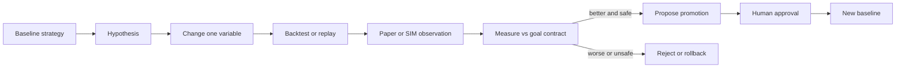
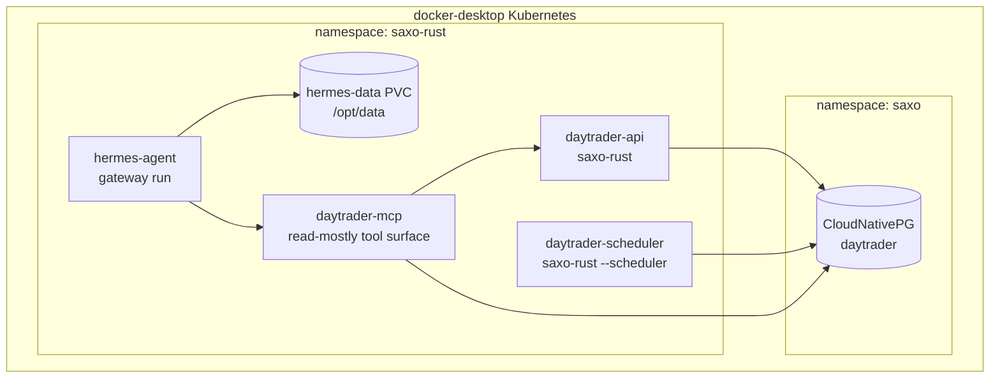
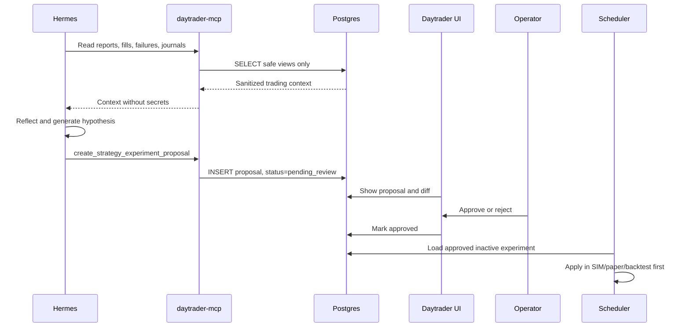
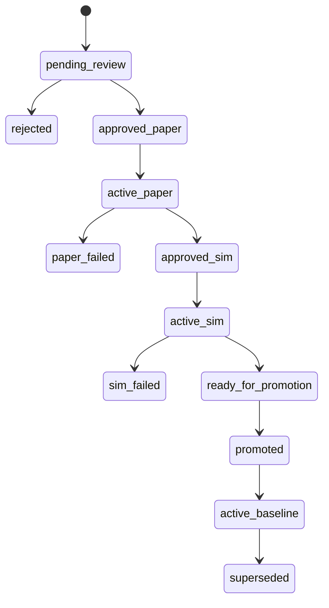

# Hermes Agent Self-Improvement Loop

This document describes how to run Hermes Agent alongside `saxo-rust` and use it as a self-improvement agent for the day/swing trading workflow.

Hermes may observe, reflect, propose, and write recommendations. It must not directly place Saxo orders, mutate Saxo sessions, hard-code credentials, or silently change the active trading strategy.

## Goal Contract

Hermes should optimize against an explicit, versioned objective. The starting contract is:

```yaml
hermes_self_improvement:
  enabled: false
  mode: recommend_only
  goal_version: 1
  objective:
    target_return_30d: 0.47
    target_return_note: "Approximately 10x in 6 months if compounded monthly: 1.47^6 ~= 10.1"
    max_drawdown: 0.20
    min_sharpe: 1.0
    failure_below_30d_return: -0.04
    reflection_every: 7d
    one_variable_only: true
  constraints:
    max_positions: 25
    slippage_tolerance: 0.02
    gas_reserve: 0.05
    min_cash_buffer_pct: 0.10
    allow_shorting: false
    require_human_approval: true
    require_backtest_before_activation: true
    require_paper_or_sim_observation: true
  experiment_policy:
    min_observation_days: 7
    min_closed_trades: 5
    promote_only_if:
      return_30d_gte: 0.47
      drawdown_lte: 0.20
      sharpe_gte: 1.0
    rollback_if:
      return_30d_lte: -0.04
      drawdown_gt: 0.20
      safety_violation: true
```

The 47% 30-day return target is intentionally aggressive. Treat it as a research objective, not as permission to increase risk until the system happens to hit the number. The hard gates are drawdown, Sharpe, cash reserve, slippage tolerance, position count, and human approval.

`gas_reserve` is a strategy-level reserve. In this equity/Saxo system it should be implemented as reserved cash or unused buying power, not as blockchain gas.

## Scientific Method Rule

Hermes must change exactly one independent variable per experiment when `one_variable_only` is true.

Examples of one variable:

- RSI entry threshold: `rsi_entry_lt: 25 -> 22`
- stop loss ATR multiple: `2.0 -> 1.7`
- max holding weight: `0.25 -> 0.20`
- xAI prompt instruction for catalyst scoring
- Trading Manager minimum reward/risk: `2.0 -> 2.5`

Examples that are not allowed as one experiment:

- Change RSI threshold and stop loss together
- Change prompt text and position sizing together
- Change universe selection and max positions together
- Change risk gates and execution mode together



## App Capabilities Hermes Should Know

Hermes should receive a concise capabilities file in its `/opt/data` profile and through the daytrader MCP adapter.

Current `saxo-rust` capabilities:

- Axum HTTP/API server and Dioxus SSR dashboard.
- Scheduler heartbeat in `src/scheduler.rs`.
- Scheduled xAI decision report submission and polling in `src/xai_decision.rs`.
- Strategy journal generation in `src/strategy_journal.rs`.
- Trading Manager queue creation in `src/trading_manager.rs`.
- Saxo order precheck and placement path in `src/saxo_order.rs`.
- Local execution audit tables: `execution_orders`, `execution_order_events`, and `execution_fills`.
- Persistent scheduler audit tables: `scheduler_status` and `scheduler_cycle_history`.
- Strategy journal table: `strategy_journal_entries`.
- Durable Saxo session table: `saxo_sessions`.
- Kubernetes app namespace: `saxo-rust`.
- CloudNativePG database namespace: `saxo`.

Capabilities Hermes must treat as unavailable until explicitly added:

- Direct Saxo session/token access.
- Direct order placement, replace, cancel, or approval.
- Direct mutation of runtime config.
- Direct deployment to Kubernetes.
- Direct changes to live strategy baseline.

## Kubernetes Deployment

Hermes should run as a separate workload in the same Docker Desktop cluster and namespace as the app.



Recommended first deployment:

- `Deployment/hermes-agent`, one replica.
- `PersistentVolumeClaim/hermes-data`, mounted at `/opt/data`.
- `Service/hermes-gateway`, ClusterIP, port `8642`.
- Optional dashboard port `9119`, ClusterIP only.
- `Secret/hermes-env` for model provider keys, messaging tokens, and `API_SERVER_KEY`.
- No public ngrok endpoint until authorization and threat model are reviewed.

Hermes state under `/opt/data` contains memories, skills, sessions, cron jobs, logs, and secrets. Do not run two Hermes gateway pods against the same PVC.

Implemented initial Kubernetes support:

- `deploy/k8s/base/hermes.yaml` defines `hermes-agent`, `hermes-data`, `hermes-gateway`, and `hermes-daytrader-context`.
- `deploy/k8s/base/kustomization.yaml` includes the Hermes resources in the base deployment.
- `scripts/deploy_k8s_docker_desktop.sh` creates a separate `hermes-env` secret from a whitelist of Hermes/model/chat variables.
- `hermes-daytrader-context` mounts read-only files at `/opt/daytrader-context` so the agent can inspect app capabilities and the self-improvement goal contract without receiving Saxo secrets.
- `saxo-rust` exposes protected `/api/hermes/*` adapter endpoints for capabilities, context, reflections, and experiment proposals.
- Set `HERMES_DAYTRADER_API_KEY` and send it as `x-hermes-api-key` or `Authorization: Bearer ...` when calling those adapter endpoints.
- The Rust dashboard includes a `Hermes` tab that reads `hermes_reflections`, `strategy_experiments`, and the active `strategy_baselines` audit record so operators can review reflections, move one-variable proposals through the lifecycle, and see the promoted baseline context.
- `CronJob/hermes-weekly-reflection` submits a scheduled run to Hermes' `/v1/runs` API. It is created suspended by default and can be enabled once `HERMES_API_SERVER_ENABLED=true`, `HERMES_API_SERVER_KEY`, and `HERMES_DAYTRADER_API_KEY` are configured.

Current limitations:

- Hermes is not yet connected to a native MCP adapter; the first adapter surface is HTTP.
- The weekly reflection CronJob is installed but suspended by default.
- Promotion creates an active baseline audit record, but there is still no automatic live strategy activation path.
- The Hermes gateway service is ClusterIP only; there is no ngrok/public exposure.

Hermes Docker runtime notes from the upstream documentation:

- The official image keeps all user data under `/opt/data`.
- Gateway mode listens on port `8642` when the API server is enabled.
- The dashboard uses port `9119` when `HERMES_DASHBOARD=1`.
- The image entrypoint should not be bypassed because it initializes the data directory before running the requested command.

## Safe Integration Surface

Prefer a small `daytrader-mcp` adapter over broad database access.

Initial HTTP adapter endpoints are implemented in `saxo-rust`:

- `GET /api/hermes/capabilities`
- `GET /api/hermes/context?limit=20`
- `GET /api/hermes/reflections?limit=20`
- `POST /api/hermes/reflections`
- `GET /api/hermes/experiments?limit=20`
- `POST /api/hermes/experiments`

These endpoints require `HERMES_DAYTRADER_API_KEY`. They intentionally expose sanitized decision reports and execution context, not Saxo sessions or broker mutation tools.

`GET /api/hermes/context` also includes the active strategy baseline audit record when one has been promoted. That record contains the promoted experiment id, goal version, changed variable, prompt/config payload, and source metadata, but it does not grant Hermes any extra write authority.

## Dashboard Review Tab

The Dioxus dashboard has a `Hermes` tab at `/?view=hermes`.

The tab shows:

- Reflection counts, experiment counts, pending proposal counts, latest reflection timestamp, goal version, finding count, and proposed-action count.
- The latest reflection summary and proposed actions.
- A recent reflection table backed by `hermes_reflections`.
- A strategy experiment proposal table backed by `strategy_experiments`.

The tab also exposes operator-only lifecycle actions. These actions update `strategy_experiments` status and, on promotion, create a `strategy_baselines` audit record. They do not place orders, approve live orders, change Kubernetes secrets, or activate live broker behavior.

Supported lifecycle transitions:

- `pending_review` -> `approved_paper` or `rejected`
- `approved_paper` -> `active_paper` or `rejected`
- `active_paper` -> `approved_sim`, `paper_failed`, or `rejected`
- `approved_sim` -> `active_sim` or `rejected`
- `active_sim` -> `ready_for_promotion`, `sim_failed`, or `rejected`
- `ready_for_promotion` -> `promoted` or `rejected`

## SIM/Paper Experiment Overlays

The Rust Trading Manager can load one approved Hermes experiment as a runtime overlay without rewriting config files or changing the active baseline.

Overlay loading rules:

- Applies only when `execution.mode` is not `live`, or when `saxo.environment=SIM`.
- Never applies when `execution.mode=live` and `saxo.environment=LIVE`.
- Reads only experiments with status `approved_sim`, `active_sim`, `approved_paper`, or `active_paper`.
- Picks the most recent supported experiment from the latest 10 approved rows.
- Adds the applied overlay into `trading_manager_runs.manager_json` and queued order `request_json` for auditability.

Supported one-variable overlay paths:

- `execution.min_trade_value_dkk`
- `strategy.capital.min_cash_buffer_pct`
- `strategy.swing.cash_buffer_pct`
- `strategy.swing.daily_indicators.min_confluences`

Unsupported variables are ignored and logged. The overlay affects queue creation only; it does not call Saxo, approve live orders, mutate secrets, or activate live broker behavior.

## Weekly Reflection Job

The Kubernetes base includes a suspended weekly reflection job:

```bash
rtk kubectl --context docker-desktop -n saxo-rust get cronjob hermes-weekly-reflection
```

Enable it only after setting:

```bash
HERMES_API_SERVER_ENABLED=true
HERMES_API_SERVER_HOST=0.0.0.0
HERMES_API_SERVER_KEY=<strong Hermes API key>
HERMES_INFERENCE_PROVIDER=xai
HERMES_MODEL=grok-4
HERMES_DAYTRADER_API_KEY=<strong app adapter key>
```

Then redeploy and unsuspend:

```bash
rtk make k8s-deploy
rtk kubectl --context docker-desktop -n saxo-rust patch cronjob hermes-weekly-reflection -p '{"spec":{"suspend":false}}'
```

The CronJob calls `http://hermes-gateway.saxo-rust:8642/v1/runs` with a prompt that instructs Hermes to:

- Fetch `/api/hermes/context?limit=40` using `HERMES_DAYTRADER_API_KEY`.
- Analyze the last week against the goal contract.
- Write exactly one reflection via `/api/hermes/reflections`.
- Create at most one experiment via `/api/hermes/experiments`.
- Change exactly one variable when proposing an experiment.
- Avoid `/api/saxo/*`, Saxo tokens, account keys, broker mutation endpoints, and Kubernetes secret mutation.

Smoke-test finding: Hermes' API server starts only when `API_SERVER_ENABLED=true` and `API_SERVER_HOST=0.0.0.0` are present inside `hermes-env`. The deploy script maps the committed `.env` names `HERMES_API_SERVER_ENABLED` and `HERMES_API_SERVER_HOST` to those runtime names. Hermes model selection is persisted in `/opt/data/config.yaml`; the Kubernetes deployment applies `HERMES_MODEL` and `HERMES_INFERENCE_PROVIDER` to that config on pod startup so a recreated PVC does not fall back to an inaccessible default model.

Unattended-run caveat: the current HTTP adapter works, but Hermes may pause for approval before terminal-based internal HTTP calls. A manual smoke run completed after approving the internal `daytrader-api` context/reflection calls for the session. Fully unattended weekly runs should wait for a native MCP adapter or a narrowly reviewed Hermes approval policy for the protected daytrader adapter.

Read-only tools:

- `get_app_capabilities`
- `get_goal_contract`
- `list_recent_scheduler_cycles`
- `list_recent_decision_reports`
- `list_strategy_journal_entries`
- `list_execution_orders`
- `list_execution_failures`
- `list_execution_events`
- `summarize_symbol_history`
- `summarize_strategy_metrics`

Restricted write tools:

- `create_hermes_reflection`
- `create_strategy_experiment_proposal`
- `create_prompt_change_proposal`
- `create_config_change_proposal`

Forbidden tools:

- Saxo token/session reads.
- Saxo OAuth refresh/disconnect.
- Order precheck/place/replace/cancel.
- Approval of live orders.
- Kubernetes deploy/apply.
- Direct writes to active config maps or secrets.



## Strategy Artifact Model

Hermes should propose structured artifacts, not free-form edits to runtime config.

Suggested tables:

```sql
CREATE TABLE strategy_baselines (
  id INTEGER PRIMARY KEY,
  created_at TEXT NOT NULL,
  activated_at TEXT,
  status TEXT NOT NULL,
  goal_version INTEGER NOT NULL,
  config_json TEXT NOT NULL,
  prompt_json TEXT NOT NULL,
  source TEXT NOT NULL
);

CREATE TABLE strategy_experiments (
  id INTEGER PRIMARY KEY,
  created_at TEXT NOT NULL,
  status TEXT NOT NULL,
  baseline_id INTEGER NOT NULL,
  hypothesis TEXT NOT NULL,
  changed_variable_path TEXT NOT NULL,
  old_value_json TEXT NOT NULL,
  new_value_json TEXT NOT NULL,
  expected_effect TEXT NOT NULL,
  risk_notes TEXT NOT NULL,
  evidence_json TEXT NOT NULL,
  approval_json TEXT,
  metrics_json TEXT,
  FOREIGN KEY(baseline_id) REFERENCES strategy_baselines(id)
);

CREATE TABLE hermes_reflections (
  id INTEGER PRIMARY KEY,
  created_at TEXT NOT NULL,
  period_start TEXT NOT NULL,
  period_end TEXT NOT NULL,
  goal_version INTEGER NOT NULL,
  summary TEXT NOT NULL,
  findings_json TEXT NOT NULL,
  proposed_actions_json TEXT NOT NULL,
  source_session_id TEXT
);
```

For PostgreSQL deployment these should use `BIGSERIAL` or identity columns. The app already uses `sqlx::AnyPool`, so schema changes need to stay compatible with both local SQLite and Kubernetes PostgreSQL.

## Knowledge Wiki Integration

Hermes should also feed the LLM-maintained project wiki described in [docs/project-wiki.md](/Users/lindau/codex/rust_daytrader/docs/project-wiki.md). The database remains the audited source of truth for proposals, approvals, metrics, and active baselines; the wiki is the human-readable synthesis layer that future Codex and Hermes sessions can search.

Suggested mapping:

- Weekly reflection -> `wiki/experiments/` or a concept page update.
- Strategy hypothesis -> experiment note linked from `wiki/index.md`.
- Rejected idea -> experiment note with rejection evidence, not deletion.
- Reusable broker/safety lesson -> concept or runbook page.
- Major workflow change -> decision record under `wiki/decisions/`.

After Hermes or Codex files durable learning into the wiki, update [wiki/index.md](/Users/lindau/codex/rust_daytrader/wiki/index.md) and append [wiki/log.md](/Users/lindau/codex/rust_daytrader/wiki/log.md). Searchable wiki state can be indexed with qmd and browsed in Obsidian.

## Applying Self-Improved Strategies

The app should apply Hermes proposals through a controlled promotion pipeline.

1. Hermes creates a proposal in `strategy_experiments`.
2. Daytrader UI renders:
   - baseline
   - changed variable
   - expected effect
   - backtest/replay evidence
   - risk notes
   - exact prompt/config diff
3. Operator approves the experiment for SIM/paper mode.
4. Scheduler/Trading Manager loads approved experiment as an overlay, not as a config rewrite.
5. Results are measured against the goal contract.
6. Operator promotes a winning experiment to a new baseline audit record.
7. Hermes context and future xAI decision prompts receive the active baseline id and payload as advisory context.
8. Live execution still requires a separate reviewed implementation and human approval.



## Prompt Improvement

Hermes may propose changes to xAI prompting, but prompt changes are strategy variables and follow the same one-variable rule.

Prompt proposal format:

```json
{
  "proposal_type": "prompt_change",
  "changed_variable_path": "xai.decision_prompt.rules[3]",
  "old_value": "Suggested trades must be conservative...",
  "new_value": "Suggested trades must include a catalyst score...",
  "hypothesis": "Adding catalyst score improves trade selection by filtering weak setups.",
  "expected_metric_effect": "Higher Sharpe and fewer low-conviction BUY orders.",
  "safety_review": {
    "secrets_exposed": false,
    "increases_live_order_authority": false,
    "requires_live_mode": false
  }
}
```

## Secret Handling

Hermes must never store, print, infer, or hard-code:

- Saxo access tokens.
- Saxo refresh tokens.
- Saxo `ClientKey`.
- Saxo `AccountKey`.
- Saxo client secret.
- xAI/OpenAI/OpenRouter API keys.
- ngrok API key or authtoken.
- Database credentials.
- TradingView credentials or TOTP seed.

Secrets stay in Kubernetes secrets or environment references. In YAML/config examples, use `ENV:NAME` or `${NAME}`, never literal values.

The MCP adapter must sanitize all responses before Hermes sees them. This includes filtering `saxo_sessions`, request headers, OAuth callback payloads, and raw broker responses that may contain account identifiers.

## Measurement

Minimum metrics per reflection period:

- 30-day realized return.
- 30-day unrealized plus realized return.
- Max drawdown.
- Sharpe ratio.
- Win rate.
- Average win/loss.
- Slippage realized vs expected.
- Number of positions.
- Number of live orders.
- Failed prechecks.
- Failed placements.
- Orders skipped by risk gates.
- Cash reserve.

Sharpe should be calculated consistently:

```text
sharpe = (portfolio_return - risk_free_return) / portfolio_return_volatility
```

For short windows, label the metric as estimated and avoid promoting solely from Sharpe. Require enough closed trades and observation days.

## Reflection Cadence

Recommended jobs:

- Daily EOD: summarize decisions, executions, failures, and risk gate skips.
- Weekly: run the Hermes reflection loop and create at most one new experiment.
- Monthly: compare active baseline vs goal contract and decide whether to keep, rollback, or propose a new baseline.

Hermes weekly reflection prompt:

```text
Review the last 7 days of daytrader decisions, strategy journals, execution orders,
fills, skipped trades, precheck failures, and portfolio metrics.

Use the goal contract exactly. Propose at most one strategy or prompt variable change.
Do not request Saxo tokens or secrets. Do not propose live order mutations.
If evidence is insufficient, create a reflection with no experiment.
```

## Rollout Plan

1. Deploy Hermes in `saxo-rust` with ClusterIP-only access. Initial manifests are implemented in `deploy/k8s/base/hermes.yaml`.
2. Add a read-only `daytrader-mcp` adapter. The current first adapter is protected HTTP; native MCP is still pending.
3. Add `hermes_reflections` and `strategy_experiments`. Implemented.
4. Add a Hermes dashboard tab to the Rust UI. Implemented as a read-only review tab.
5. Add weekly reflection cron. Implemented as suspended by default.
6. Add SIM/paper experiment overlays. Implemented for Trading Manager cash buffer, min trade value, and technical confluence gates.
7. Add promotion flow from approved experiment to active baseline audit record. Implemented in the Hermes dashboard.
8. Wire active baseline context into Hermes context and xAI decision prompts. Implemented as advisory prompt/context data only.
9. Only then consider live-mode overlays, still behind human approval and rollback gates.

## Non-Negotiable Safety Invariants

- Hermes cannot access `saxo_sessions`.
- Hermes cannot place, approve, replace, or cancel orders.
- Hermes cannot change Kubernetes secrets.
- Hermes cannot change the active baseline without approval.
- Each experiment changes one variable.
- Every proposal has an audit row.
- Every active decision references the active baseline id.
- Every broker mutation remains auditable through the existing Saxo order path.
