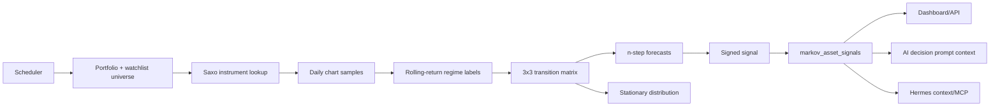

# Markov Method

The Markov method is an advisory regime skill for the Rust daytrader. It runs daily over the current portfolio and watchlist universe, stores one signal row per asset, and exposes the results to the dashboard, API, Hermes context, and AI decision prompts.

Source inspiration:

- [jackson-video-resources/markov-hedge-fund-method](https://github.com/jackson-video-resources/markov-hedge-fund-method)
- [markov-hedge-fund-method.md](https://github.com/jackson-video-resources/markov-hedge-fund-method/blob/main/markov-hedge-fund-method.md)

The linked method describes a module that fetches daily OHLCV, labels each day Bull/Bear/Sideways from rolling returns, estimates a 3x3 transition matrix by maximum-likelihood counts, forecasts with matrix powers, solves a stationary distribution, and reports a signed signal.

## Runtime Contract

- The scheduler runs the skill once per configured local trading day after `strategy.markov.daily_time`.
- Asset membership comes from the versioned `market_data.watchlists.universe_symbols` configuration, with current broker positions and `extra_symbols` added automatically. Historical report, quote, and sentiment tables are observations, not the intended source of membership; they are retained only as a warning-level migration fallback when no configured universe exists.
- The default label rule is a 20-trading-day rolling return:
  - `Bull` when return is `>= +5%`
  - `Bear` when return is `<= -5%`
  - `Sideways` otherwise
- The transition matrix is ordered `Bull`, `Sideways`, `Bear`.
- Forecasts use Chapman-Kolmogorov matrix powers for configured horizons.
- The signed signal is `bull_prob - bear_prob` at `strategy.markov.signal_horizon_days`.
- The signal is advisory only. It does not approve, place, replace, or cancel orders.

## Data Flow



## Storage

The runtime creates:

- `markov_signal_runs`: one daily run summary.
- `markov_asset_signals`: one asset-level result per run.

Each signal stores the current regime, rolling return, transition counts, transition probabilities, forecast distributions, stationary distribution, signed signal, direction, conviction, and any per-asset error.

## Configuration

```yaml
strategy:
  markov:
    enabled: true
    timezone: Europe/Copenhagen
    daily_time: "23:30"
    run_weekdays_only: true
    window_days: 20
    threshold: 0.05
    horizon_minutes: 1440
    sample_count: 520
    min_labeled_days: 60
    signal_horizon_days: 5
    forecast_steps: [1, 2, 3, 5, 10]
    max_symbols: 0
    instrument_negative_cache_retry_days: 7
    symbol_aliases:
      "COST:xnys": "COST:xnas"
```

`max_symbols: 0` means no local cap. If Saxo rate limits become an issue, set a cap while we add batching or throttling.

`symbol_aliases` is intentionally analysis-only. Markov and daily indicators keep rows keyed by the original portfolio/watchlist symbol, but resolve Saxo charts through the configured alias and record alias metadata in the Markov raw payload. Execution orders are not rewritten by this setting.

## Operator Surfaces

- Dashboard: `/?view=markov`
- API: `/api/markov/signals`
- Hermes MCP tool: `get_markov_signals`
- AI decision prompt context: `markov_method`

## Safety

The Markov skill reads Saxo chart data and writes local analytics rows. It has no broker mutation path and no access to order approval endpoints. A negative signal should be treated as risk-reduction or stand-down context unless a separately reviewed strategy change permits short exposure.
