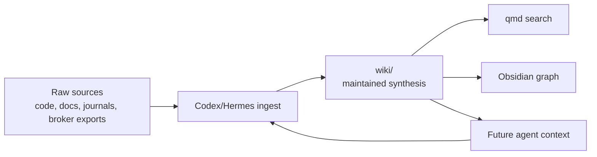

# Project Knowledge Wiki

This repository uses an LLM-maintained wiki pattern for project knowledge that should compound over time instead of being rediscovered from raw files on every question.

The source idea is [llm-wiki.md](/Users/lindau/codex/rust_daytrader/llm-wiki.md), by Andrej Karpathy. Original gist: [karpathy/442a6bf555914893e9891c11519de94f](https://gist.github.com/karpathy/442a6bf555914893e9891c11519de94f). The concrete project wiki lives under [wiki/](/Users/lindau/codex/rust_daytrader/wiki).

## Purpose

The wiki is the maintained knowledge layer between raw project sources and future LLM/Hermes sessions.

Use it to preserve:

- Architecture decisions and migration status.
- Saxo safety constraints and broker behavior lessons.
- Hermes reflections and self-improvement experiments.
- Strategy hypotheses, results, and rejected ideas.
- Operational runbooks for Kubernetes, CNPG, ngrok, qmd, and Obsidian.
- Cross-links between code, config, deployment, strategy, and journal history.

The wiki is not a replacement for source code, tests, or audited database records. It is a maintained synthesis layer that makes future reasoning faster and less repetitive.

## Directory Structure

```text
wiki/
  index.md              # Content-oriented map of maintained pages
  log.md                # Append-only timeline of wiki maintenance
  schema.md             # Rules future LLMs must follow
  concepts/             # Synthesized concept and architecture notes
  sources/              # Source-note pages that summarize immutable inputs
  runbooks/             # Operational procedures
  experiments/          # Hermes/strategy experiment notes
  decisions/            # Architecture decision records
```

Raw sources remain outside the generated wiki when possible. Examples are [llm-wiki.md](/Users/lindau/codex/rust_daytrader/llm-wiki.md), [STRATEGY.md](/Users/lindau/codex/rust_daytrader/STRATEGY.md), [swing-trading-rules.md](/Users/lindau/codex/rust_daytrader/swing-trading-rules.md), code, deployment manifests, screenshots, broker exports, and database records.

## Roles

- Human: curates sources, asks questions, approves strategy changes, and decides what matters.
- Codex: maintains wiki pages while working in the repo, updates cross-links, and logs changes.
- Hermes: writes reflections, strategy experiment proposals, and lessons into controlled tables and wiki pages.
- qmd: searches the markdown wiki/docs locally.
- Obsidian: browses the wiki graph, backlinks, tags, and notes.



## qmd Setup

Run setup from the repository root when you want local markdown search:

```bash
rtk qmd init
rtk qmd collection add /Users/lindau/codex/rust_daytrader/wiki --name daytrader-wiki
rtk qmd collection add /Users/lindau/codex/rust_daytrader/docs --name daytrader-docs
rtk qmd collection add /Users/lindau/codex/rust_daytrader --name daytrader-root-md
rtk qmd update
rtk qmd embed -c daytrader-wiki
```

Use lexical search for exact names and symbols:

```bash
rtk qmd search "saxo_sessions durable session" -c daytrader-wiki -n 10
```

Use hybrid search for conceptual recall:

```bash
rtk qmd query "how does Hermes propose one-variable strategy experiments" -c daytrader-wiki -n 10
```

If qmd uses a project-local `.qmd/` index, keep it uncommitted. The directory is ignored because it is generated local state.

## Obsidian Setup

Open `/Users/lindau/codex/rust_daytrader` as an Obsidian vault, or link the `wiki/` directory into an existing vault. Once the repo is open as a vault, useful CLI commands are:

```bash
rtk obsidian open path=wiki/index.md
rtk obsidian backlinks path=wiki/concepts/hermes-self-improvement.md counts
rtk obsidian orphans total
rtk obsidian unresolved total
```

Local Obsidian workspace state is ignored through `.obsidian/`.

## Maintenance Workflow

When a new source matters:

1. Add or reference the immutable source.
2. Create or update a page under `wiki/sources/`.
3. Update affected concept, runbook, decision, or experiment pages.
4. Update [wiki/index.md](/Users/lindau/codex/rust_daytrader/wiki/index.md).
5. Append an entry to [wiki/log.md](/Users/lindau/codex/rust_daytrader/wiki/log.md).

When answering a question that creates reusable insight:

1. Search the wiki first.
2. Read the relevant pages and source notes.
3. Answer with file references.
4. File durable conclusions back into the wiki if they should survive the chat.

When linting:

- Check for orphan pages.
- Check for unresolved wikilinks.
- Check for stale claims superseded by newer code or docs.
- Check for concepts mentioned repeatedly but lacking a page.
- Check that Hermes experiment notes reference the active baseline and goal contract.

## Hermes Integration

Hermes should write durable learnings in two places:

- Database tables for audited reflections and strategy experiments.
- Wiki pages for human-readable synthesis and cross-links.

The wiki should never contain secrets, Saxo tokens, raw account keys, or unredacted broker responses. It should link to sanitized summaries and audited records only.

For the full Hermes safety and experiment model, see [docs/hermes-agent.md](/Users/lindau/codex/rust_daytrader/docs/hermes-agent.md).
