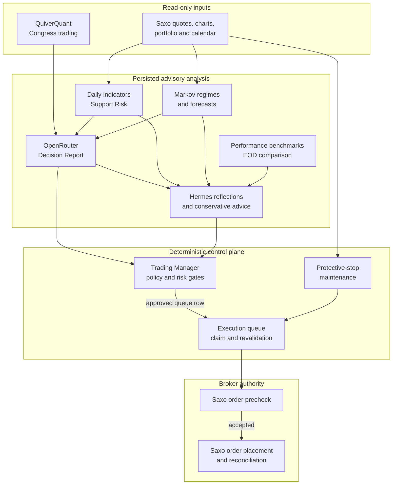

# Current System Architecture

The active runtime is one Rust/Axum/Dioxus application with a separate scheduler workload in the `saxo` Kubernetes namespace. It uses a CloudNativePG database for durable state, RustFS for S3-compatible database backups, and an internal-only Hermes/MCP integration. The shared ngrok gateway owns the public `/saxo-daytrader` route; this repository owns only the internal application endpoint.

## Read, Advise, Gate, Execute

## Advisory Inputs

- **Markov:** a daily three-regime model for portfolio and watchlist assets. It labels rolling returns, estimates transition probabilities, forecasts horizon distributions, and emits a signed Bull-minus-Bear signal. It is context, not an order trigger. See [Markov Method](/Users/lindau/codex/rust_daytrader/docs/markov-method.md).
- **Support Risk:** daily chart-history analysis identifies clustered support zones. For an available asset it records nearest support, downside to support, downside after a break, break risk, and confidence. The result helps an operator, Decision Report, and Hermes reason about downside; it does not independently block or approve an order.
- **QuiverQuant:** a calendar-aware US Congress-trading run begins 45 minutes after the Saxo US open. Its signal is corroborating/risk-reducing context and must be fresh before the later US Decision Report treats it as current. See [QuiverQuant Advisory Signals](/Users/lindau/codex/rust_daytrader/docs/quiver-signals.md).
- **Benchmarks:** Saxo-backed ETF proxy series compare stored portfolio return with selected regional/US reference returns in the End-of-Day view. Excess return is an observational performance measure and is deliberately excluded from selection, sizing, stops, and broker execution. See [Performance Benchmarks](/Users/lindau/codex/rust_daytrader/docs/performance-benchmarks.md).
- **Hermes:** reads a sanitised MCP/API context, reflects daily and weekly, proposes one-variable experiments, and gives bounded per-report advice. In conservative mode it can reduce, block, or require review, never create or enlarge a candidate.

## Execution Boundary

An AI response, Hermes action, Markov value, Quiver signal, or Support Risk value is never a broker instruction. The hard boundary comprises four independent controls:

1. **Response validation:** a malformed or non-JSON provider response becomes an errored Decision Report. The normalized report is scope-filtered before manager consideration.
2. **Trading Manager gating:** only fresh eligible reports enter deterministic gates. The manager uses local/broker-aware evidence for order shape, open market, cash deployment, loss/drawdown circuit breakers, exclusions/quarantine, technical/Markov evidence, ATR risk per trade, concentration, holdings, costs, and minimum trade value.
3. **Execution queue revalidation:** only manager-approved rows exist in the queue. The executor is configuration-gated, claims a row once, and checks session, market, quantity, sellable holdings, Saxo instrument/UIC, and tick size before creating a broker payload.
4. **Saxo enforcement:** `/trade/v2/orders/precheck` must succeed before placement. Saxo remains the authority for account, instrument, price, market, and buying-power validation. Unknown placement outcomes are reconciled rather than automatically retried.

Prompt-injection resistance reduces the likelihood of an unsafe suggestion, but it is not relied on as the enforcement mechanism. The manager, executor, and Saxo precheck are the enforcement mechanism. This does not guarantee that a syntactically valid trade is a profitable one; it limits which proposals can become broker requests.

## Protective Stops

The scheduler separately maintains broker-hosted protective stops for eligible held positions under the configured ATR policy. A ratchet only moves a stop upward after sufficient favourable price movement, and stop changes use the same Saxo validation and audit path. Stops are a loss-containment mechanism, not a guarantee: gap risk, halted/closed markets, liquidity, broker availability, and cancellation/replacement timing remain real risks. A discretionary SELL cancels a matching resting protective stop only at the controlled execution chokepoint, then a later sweep may re-protect any residual holding.

## Ownership And Secrets

- The app owns the Rust API/dashboard, scheduler, internal `saxo-daytrader.internal` endpoint, app database access, and read-only Hermes adapter.
- The shared gateway owns public ngrok routing, OAuth provider configuration, and public allow-list policy.
- Hermes receives a separate secret whitelist and no Saxo credentials, session files, account keys, broker mutation tools, or Kubernetes tools.
- The wiki and dashboard read models must not expose tokens, account identifiers, raw broker payloads, or unredacted execution errors.

## Related

- [Hermes self-improvement](hermes-self-improvement.md)
- [Wiki schema](../schema.md)
- [Build, test, and deploy runbook](../runbooks/build-test-deploy.md)
