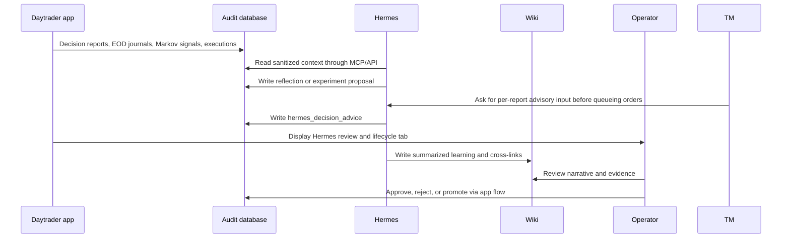

# Hermes Self-Improvement Knowledge Loop

Hermes should use the wiki as the human-readable memory layer for strategy learning, while audited database tables remain the source of truth for proposals, approvals, metrics, and active baselines.

## Loop

## What Belongs In The Wiki

- Daily Hermes end-of-day learning summaries, including at most one pending-review experiment proposal when a same-day learning is concrete and safe to test.
- Weekly Hermes learning summaries for self-improvement decisions and evidence-backed one-variable experiment proposals.
- One-variable experiment hypotheses.
- Why a strategy change was approved, rejected, or rolled back.
- Links to relevant source files, reports, and audited records.
- Lessons that should influence future prompts or implementation work.
- Per-decision-report Hermes advice summaries when they reveal a repeated pattern in candidate quality, Markov confirmation, execution failures, or cash deployment.

## What Does Not Belong In The Wiki

- Saxo tokens or session payloads.
- Saxo `AccountKey` or `ClientKey`.
- API keys, secrets, or raw OAuth payloads.
- Unredacted broker responses.
- Unapproved live trading instructions.

## Maintenance Rules

- Every strategy experiment note must reference the goal contract in [docs/hermes-agent.md](/Users/lindau/codex/rust_daytrader/docs/hermes-agent.md).
- Every experiment should name exactly one changed variable when `one_variable_only` is true.
- Every active strategy lesson should distinguish hypothesis, evidence, metric result, and promotion status.
- Wiki notes are explanatory; the app applies strategy changes only through approved artifacts and scheduler overlays.
- The dashboard `Hermes` tab is the operator lifecycle surface. It can move experiments through paper/SIM states and create baseline audit records, but it must not place orders or activate live broker behavior.
- Promoted baseline audit records are visible in the dashboard `Hermes` tab, included in `/api/hermes/context`, and included in AI decision prompt payloads as advisory context.
- Hermes should prefer the `daytrader` MCP adapter for scheduled reflections because its tool allowlist is narrower than generic HTTP access.
- Hermes should read `get_decision_reports`, `get_end_of_day_reports`, and `get_markov_signals` before proposing a strategy experiment.
- Daily Hermes learning runs should summarize the day and preserve evidence from decision reports, EOD reports, Markov regime signals, scheduler status, executions, and failures. They may create at most one pending-review one-variable experiment proposal when the learning is specific, safe to test, and not a duplicate of an active or pending proposal.
- Weekly Hermes learning runs should create one pending-review one-variable experiment proposal when the week contains enough evidence and no duplicate proposal already covers the same variable. If evidence is insufficient, the strongest candidate belongs in `proposed_actions`.
- The dashboard derives a bounded `Lessons Pending Review` queue from recent reflection `proposed_actions` so non-experiment learnings remain visible to an operator. It collapses duplicate normalized action text to the newest row and exposes only safe reflection context; it is read-only and cannot approve an experiment, change configuration, or affect broker behavior. Sensitive-looking action text is redacted.
- The dashboard's read-only `One-Variable Audit` separates a promoted baseline audit artifact from the one supported experiment overlay selected for the next eligible Trading Manager cycle. It reuses the manager's selection rules, reports whether the same overlay appeared in the latest manager run, and never claims a persistent config rewrite or live activation.
- The dashboard's read-only `Proposal Quality Review` scores only safe persisted proposal metadata: one-variable path, attached and named evidence, measurable expected effect, changed values with risk notes, and active exact or related-family duplicate risk. It is operator context only; it cannot create, transition, approve, activate, or promote an experiment, and it excludes raw evidence, risk notes, hypotheses, and provider payloads.
- Trading Manager experiment overlays currently apply only in paper/simulation or Saxo SIM, and only for the allowlisted variables documented in [docs/hermes-agent.md](/Users/lindau/codex/rust_daytrader/docs/hermes-agent.md).
- Trading Manager asks Hermes for per-decision-report advice through the `create_decision_advice` MCP tool. Kubernetes runs this in `conservative` mode: Hermes may only block, reduce, or require review and must never add trades, increase size, approve live orders, or call Saxo mutation endpoints. Missing or timed-out conservative advice requires review rather than silently allowing orders.

## Related

- [concepts/llm-maintained-project-wiki](llm-maintained-project-wiki.md)
- [sources/llm-wiki](../sources/llm-wiki.md)
