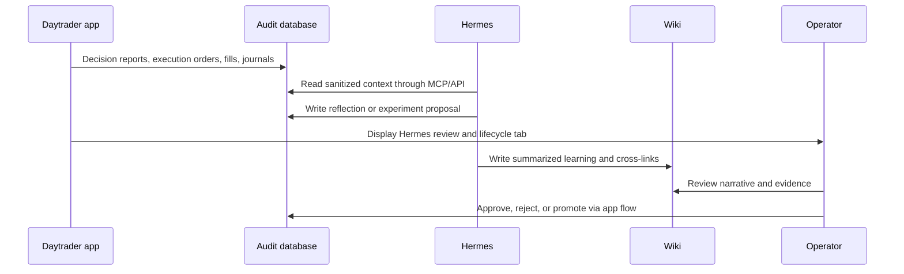

# Hermes Self-Improvement Knowledge Loop

Hermes should use the wiki as the human-readable memory layer for strategy learning, while audited database tables remain the source of truth for proposals, approvals, metrics, and active baselines.

## Loop

## What Belongs In The Wiki

- Weekly Hermes reflection summaries.
- One-variable experiment hypotheses.
- Why a strategy change was approved, rejected, or rolled back.
- Links to relevant source files, reports, and audited records.
- Lessons that should influence future prompts or implementation work.

## What Does Not Belong In The Wiki

- Saxo tokens or session payloads.
- Saxo `AccountKey` or `ClientKey`.
- API keys, secrets, or raw OAuth payloads.
- Unredacted broker responses.
- Unapproved live trading instructions.

## Maintenance Rules

- Every strategy experiment note must reference the goal contract in [docs/hermes-agent.md](/Users/lindau/codex/rust_daytrader/docs/hermes-agent.md).
- Every experiment should name exactly one changed variable when `one_variable_only` is true.
- Every active strategy lesson should distinguish hypothesis, evidence, metric result, and promotion status.
- Wiki notes are explanatory; the app applies strategy changes only through approved artifacts and scheduler overlays.
- The dashboard `Hermes` tab is the operator lifecycle surface. It can move experiments through paper/SIM states and create baseline audit records, but it must not place orders or activate live broker behavior.
- Promoted baseline audit records are visible in the dashboard `Hermes` tab, included in `/api/hermes/context`, and included in xAI decision prompt payloads as advisory context.
- Trading Manager experiment overlays currently apply only in paper/simulation or Saxo SIM, and only for the allowlisted variables documented in [docs/hermes-agent.md](/Users/lindau/codex/rust_daytrader/docs/hermes-agent.md).

## Related

- [concepts/llm-maintained-project-wiki](llm-maintained-project-wiki.md)
- [sources/llm-wiki](../sources/llm-wiki.md)
