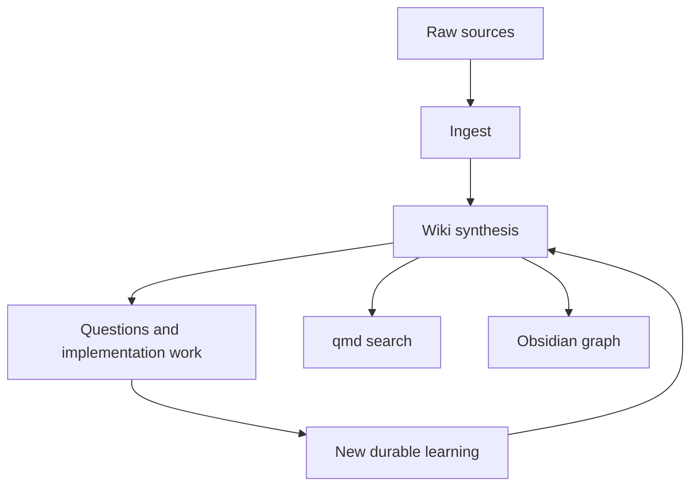

# LLM-Maintained Project Wiki

The daytrader project should use an LLM-maintained wiki as a persistent synthesis layer. The goal is to make architecture knowledge, trading lessons, operational runbooks, and strategy experiments compound across sessions. This pattern is adapted from Andrej Karpathy's LLM Wiki idea file.

## Why It Matters Here

This repository has several knowledge streams that are easy to lose:

- Rust porting status from the legacy Python/FastAPI and Next.js system.
- Saxo safety constraints around sessions, order payloads, prechecks, tick sizes, and reconciliation.
- Kubernetes deployment choices across `saxo-rust` and `saxo`.
- Strategy and prompt changes proposed by Hermes or xAI.
- Daily/weekly learnings from decision reports, execution outcomes, and strategy journals.

Raw RAG over the repo would rediscover these facts repeatedly. A maintained wiki lets agents update the synthesis once and reuse it later.

## Operating Model

## Responsibilities

Codex should update the wiki when:

- A repo change creates a new architectural or operational decision.
- A bug investigation reveals a reusable lesson.
- A Hermes reflection creates a strategy hypothesis or rejected idea.
- A user asks a question whose answer should survive the chat.

Hermes should feed the wiki through audited reflections and proposals, not by bypassing review gates.

## Boundaries

The wiki must not store secrets or become an unreviewed control plane. It should summarize and link to code/config/database records; it should not activate strategy changes.

## Related

- [schema](../schema.md)
- [sources/llm-wiki](../sources/llm-wiki.md)
- [hermes-self-improvement](hermes-self-improvement.md)
